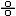
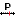

# Time-delay-root-locus
This is MATLAB tool for Root locus of time-delay systems.
Users may use this tool for any personal project, although the tool is still in development and may not work correctly. 
This tool works in classic MATLAB interface, no additional toolboxes are needed. 

QPmR algorithm from prof. Ing. Tomáš Vyhlídal, Ph.D. is used for root finding.

The tool was delepoed on MATLAB R2024b version, older version of MATLAB may not be compatible.

## How to work with tool

This tool is able to draw root locus of time delay systems

$$ H(s) = \frac{h_\mathrm{num}(s)}{h_\mathrm{den}(s)} $$

where $h_\mathrm{num}(s)$ and $h_\mathrm{den}(s)$ represent quasipolynomials in form of

$$ 
h(s) = \sum_{i=1}^{N} p_\mathrm{i} e^{-\alpha_\mathrm{i}s}
$$

where

$$
p_\mathrm{i}(s) = \sum_{j=1}^{n} \beta_\mathrm{ij} s^{n-j}
$$

Closed loop system is then characterized by roots (poles) of quasipolynomial

$$
h(s) = h_\mathrm{den}(s) + K \cdot h_\mathrm{num}(s)
$$

The tool is callable by tdrlocus().\
It can be called without any arguments, the clear workspace is then opened and region for computing open loop poles and zeroes is automatically set to Re = [-10,5] and Im = [0, 50]. If you want to draw the root locus for given system when calling the function, it must be in from of: tdrlocus(reg, numerator, denominator) or tdrlocus(reg, numP, numD, denP, denD). 

Argument region is a vector of length 4 that specifies thresholds of [minReal maxReal minImag maxImag]. Negative minImag values are unnecessary, positive half of the imaginary complex plane is mirrored to the negative on. 

Arguments numerator and denominator must be string values written in form of "(poly1)\*exp(-delay1\*s)+(poly2)\*exp(-delay2\*s)+...+(polyN)\*exp(-delayN\*s)". It is recommended to write polynomials in brackets and omit "\*exp(-0\*s)", in that case write only "(poly)". It is mandatory to use "+" outside the brackets. 

Arguments numP, numD, denP, denD must be matrix notations of quasipolynomial. \
The P matrix represents coefficients of polynomials

$$
P =
\begin{bmatrix}
\beta_\mathrm{11} & \beta_\mathrm{12} & \cdots & \beta_\mathrm{1n} \\
\beta_\mathrm{21} & \ddots & & \vdots \\
\vdots & & & \vdots \\
\beta_\mathrm{N1} & ... & ... & \beta_\mathrm{Nn}
\end{bmatrix}
$$

and D matrices represent delays of quasipolynomials

$$
D =
\begin{bmatrix}
\alpha_\mathrm{1}  \\
\alpha_\mathrm{2} \\
\vdots \\
\alpha_\mathrm{N}
\end{bmatrix}
$$

Each row in P matrix, i = 1,...,N is specific for given delay and each column j = 1,...,n specifies coefficient for given order of monomial. Coefficient j = 1 is tied to s^(n-1), ... j = n is coefficient of a constant. \
"num" and "den" specifies numerator or denominator quasipolynomial. Numerator and denominator matrices must not have same delays.

## Tool functions

### Working in GUI

Most of the window is covered by complex plane with drawn root locus. It is possible to change gain using slider in the bottom of the figure. You can also change gain by directly editing value in bottom window. By clicking "Toggle pole direction" you can visualize pole movement direction for increasing gain (K value).

### Toolbar tools
Going from left to right, there are following functions:

#### Edit transfer function 
You can change transfer function of the system directly in GUI, either by writing numerator and denominator directly in the string notation to corresponding windows or by loading numerator and denominator matrices from workspace.

#### Changing parametric values 
Numerical values can be substituted by parametric notation in a form of "K...", where "..." represents any integer value ("K1", "K24" etc.). Each parametric value is initiated to value = 1. By clicking second leftmost button on the toolbar, you can easily change those values inside GUI without rewriting whole transfer function. This can be useful, for example, for easy time delay editing.

#### Changing gain by dragging poles
When this function turned on, you can move poles, thus changing gain, by holding and moving poles on a complex plane.

#### Select plot region
This function opens popup figure, where drawn region can be changed inside the GUI.

#### Auto adjust plot region
This button changes drawn region to fit current section on complex plane.

#### Add real pole
Adds real pole to the system by clicking on complex plane.

#### Add imaginary poles
Adds two complex conjurates imaginary poles by clicking on complex plane.

#### Add real zero
Adds real zero to the system by clicking on complex plane.

#### Add imaginary zeros
Adds two complex conjurates imaginary zeros by clicking on complex plane.

#### Pan function
This function enables/disables pan tool.

#### Zoom in function
This function enables/disables zoom in function.

#### Zoom out function
This function enables/disables zoom out function.

#### Undo button
This button takes user back to previous state on complex plane.
