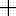
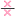

# Time-delay-root-locus
This is MATLAB tool for Root-locus of time-delay systems.
The tool is freely available to the public. As development is ongoing, occasional issues in plotting or GUI functionality may still occur.
The tool operates within the standard MATLAB interface and requires the Symbolic Math Toolbox and Control System Toolbox. It utilizes the QPmR algorithm developed by Prof. Ing. Tomáš Vyhlídal, Ph.D. [[1]](#1) [[2]](#2).

The tool was delepoed on MATLAB R2024b version, older version of MATLAB may not be compatible.

## How to work with tool

This tool is able to draw root-locus of time-delay systems. The tool is able to plot root-locus of open-loop system characterized by transfer function

$$ H(s) = \frac{h_\mathrm{num}(s)}{h_\mathrm{den}(s)} $$

where $h_\mathrm{num}(s)$ and $h_\mathrm{den}(s)$ represent quasipolynomials in form of

$$ 
h(s) = \sum_{i=1}^{N} p_\mathrm{i} e^{-\tau_\mathrm{i}s}
$$

where $p_\mathrm{i}(s)$ represent polynomial in form of

$$
p_\mathrm{i}(s) = \sum_{j=1}^{n} \gamma_\mathrm{ij} s^{n-j}
$$

Such representation allows user to call the tool as either tdrlocus(reg, num, den) or tdrlocus(reg, numP, numD, denP, denD).
The first argument, reg, defines the boundaries of the root-locus plot region using a 4-element array:

<pre>
reg = [reMin, reMax, imMin, imMax]
</pre>

All values must be real numbers. This region specifies the area of the complex plane that will be visualized in the root-locus plot.
Example of such region is

<pre>
reg = [-10, 5, 0, 50];
</pre>

The call tdrlocus(reg, num, den) requires the arguments 'num' and 'den' as string values. Example of such representation is 

<pre>
num = "1+exp(-s)";
den = "s^3+6*s^2+5*s+(2*s^2+7*s)*exp(-s)"
</pre>

The tdrlocus(reg, numP, numD, denP, denD) utilizes matrix representation of the quasipolynomial. For quasipolynomial in form described above, it's matrix representation has form of: 

$$
P =
\begin{bmatrix}
\gamma_\mathrm{11} & \gamma_\mathrm{12} & \cdots & \gamma_\mathrm{1n} \\
\gamma_\mathrm{21} & \ddots & & \vdots \\
\vdots & & & \vdots \\
\gamma_\mathrm{N1} & ... & ... & \gamma_\mathrm{Nn}
\end{bmatrix}
\hspace{10pt}
D =
\begin{bmatrix}
\tau_\mathrm{1}  \\
\tau_\mathrm{2} \\
\vdots \\
\tau_\mathrm{N}
\end{bmatrix}
$$

Matrix notation of transfer function example will have form

<pre>
numP = [1; 1];
numD = [0; 1];
denP = [1, 6, 5, 0; 0, 2, 7, 0];
denD = [0; 1];
</pre>

The tdrlocus tool can be called without any input arguments which opens blank GUI. The region is then automatically set to reg = [-10, 5, 0, 50] and system transfer function can be defined directly within the GUI.

## Tool functions
This section provides brief overview of the implemented functions. For further information see website: https://time-delay-root-locus-d308d0.gitlab.io

### Working in GUI

Most of the GUI window is occupied by the complex plane, where the computed root-locus is plotted. The gain value can be adjusted using the slider at the bottom of the window. Alternatively, you can manually enter a specific gain value in the input box next to the slider. Clicking the “Toggle pole direction” button displays arrows that indicate the direction of pole movement as the gain $K$ increases.

### Toolbar functions
Going from left to right, there are following functions:

####  Edit transfer function 
You can modify the system’s transfer function directly in the GUI, either by entering the numerator and denominator as strings in the corresponding input fields or by loading numerator and denominator matrices from the MATLAB workspace.

####  Changing parametric values 
Numerical values can be replaced with parameters in the form of "K...", where "..." is any integer (e.g., "K1", "K24"). Each parameter is initialized with a value of 1. By clicking the second-leftmost button on the toolbar, you can easily modify these values in the GUI without rewriting the entire transfer function. This is particularly useful for quickly adjusting time delays or gain values.

####  Changing gain by dragging poles 
When this function is enabled, you can adjust the gain by clicking and dragging poles directly on the complex plane.

####  Select plot region 
Opens a pop-up window that allows you to modify the plot region directly within the GUI.

####  Auto adjust plot region 
Automatically adjusts the plot region to fit the currently visible portion of the root-locus on the complex plane.

####  Add real pole 
Adds a real pole to the system by clicking on the complex plane.

####  Add imaginary poles 
Adds a pair of complex-conjugate poles by clicking on the complex plane.

####  Add real zero 
Adds a real zero to the system by clicking on the complex plane.

####  Add imaginary zeros 
Adds a pair of complex-conjugate zeros by clicking on the complex plane.

####  Pan function 
Enables or disables the pan tool for navigating the complex plane.

####  Zoom in function 
Enables or disables the zoom-in tool for magnifying a region of the complex plane.

####  Zoom out function 
Enables or disables the zoom-out tool to view a wider region of the complex plane.

####  Undo button 
Reverts to the previous state of the system on the complex plane.

## references
<a id="1">[1]</a>
Vyhlídal, T. – Zítek, P.: QPmR v.2 – Quasipolynomial rootfinder, algorithm and examples. to appear in Advances in Delays and Dynamics, Editors: Vyhídal T., Lafay J.F., Sipahi R., Sringer 2013.

<a id="2">[2]</a>
Vyhlídal, T. – Zítek, P.: Mapping Based Algorithm for Large-Scale Computation of Quasi-Polynomial Zeros. IEEE Transactions on Automatic Control. 2009, vol. 54, no. 1, p. 171-177. ISSN 0018-9286.
